# VisualNN使用指南
VisualNN是用于可视化建模神经网络的工具, 并提供模型导入导出, 在线训练的功能, 下面分节介绍一下

# 界面介绍
整个网站的界面如下所示

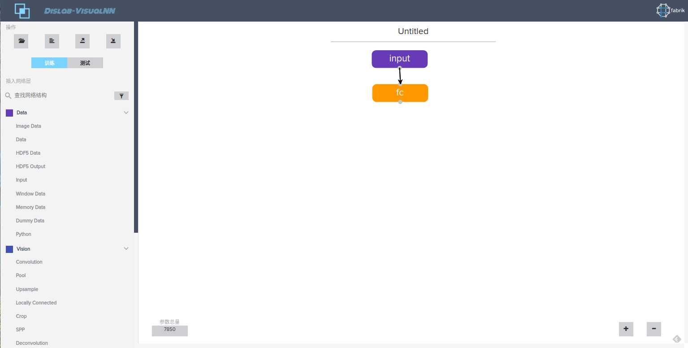

主要组成有三个部分, 左侧是神经网络单元工具箱, 中间是神经网络架构图, 右侧是网络单元参数设置界面, 可以通过拖拉拽左侧的网络单元到中间来自行搭建神经网络模型, 也可以导入系统提供的很多经典模型. 下面分节讲述每个部分的使用方法.

## 1. 工具栏介绍

具体的工具栏如下图所示, 从左到右分别提供了model zoo, load from text, export, import的功能.

* model zoo

model zoo使得用户能够直接导入一些已经设计好的经典模型, 具体界面如下所示, 目前系统还处于原型阶段, 尚未提供网络结构.

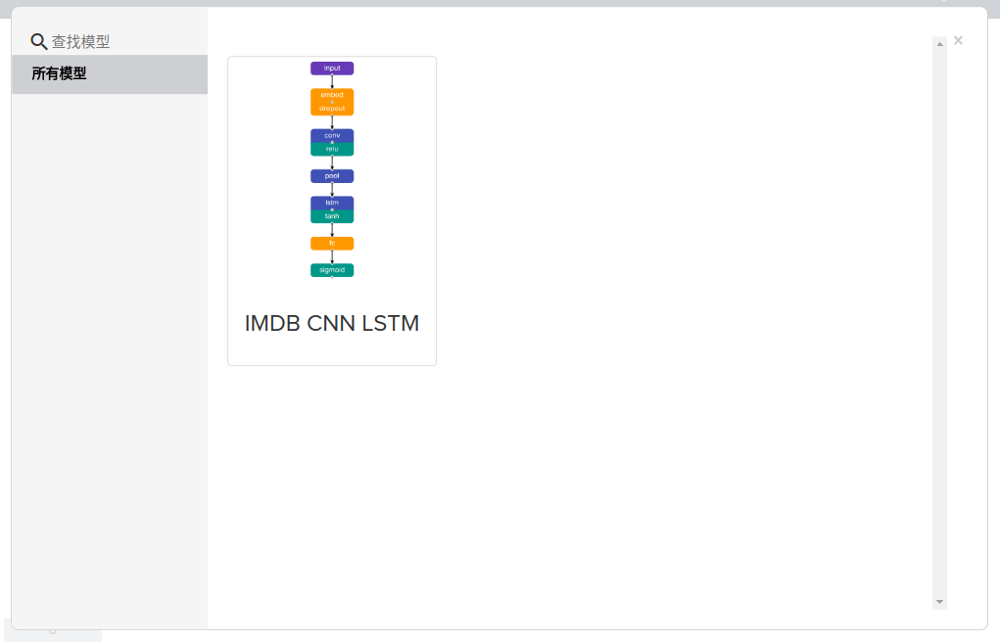

* load from text

这项功能使得用户可以通过json格式或者pb格式的输入直接导入网络结构, 具体界面如下所示:

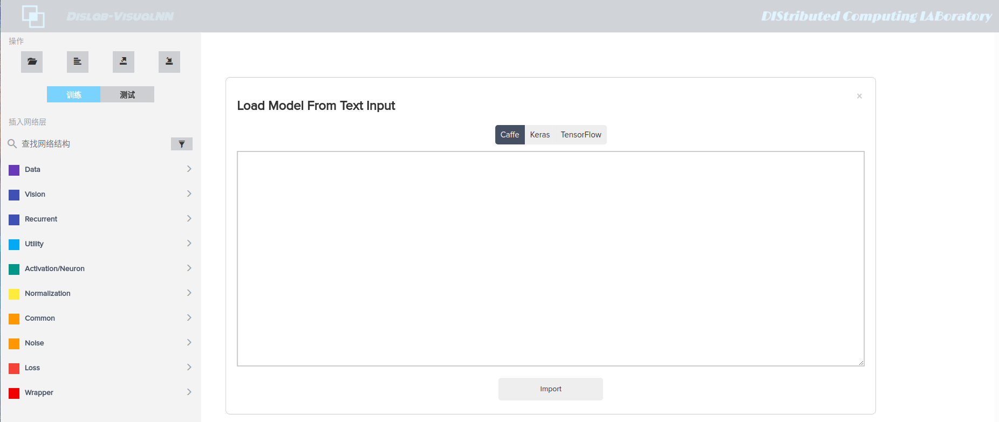

* export功能
  

用户可以通过export按钮从磁盘导入json或者pbtxt格式的模型文件, 如下图

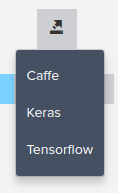

* import功能

用户可以通过import按钮将网页中设计好的神经网络文件导出为json或者pbtxt格式的文件输出到磁盘上, 如下图所示

## 2. 神经网络基本单元

VisualNN提供一些基本的网络单元来进行神经网络设计, 具体界面如下

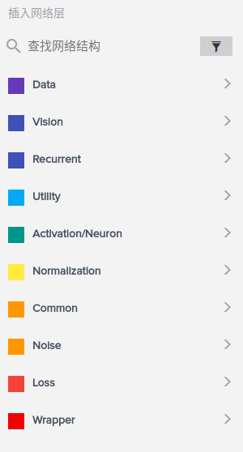

从上到下分别由Data, Vision, Recurrent, Utility, Activation, Normalization, Common, Noise, Loss, Wrapper构成.

* data层

data层主要用于定义神经网络输入的格式, 如下图所示

* vision层

Vision层包含了计算机视觉常用的一些单元, 如下图所示

下面介绍一些常用的组件

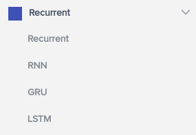

# 3.VisualNN组件介绍

### 3.1 数据层（Data）

​	data_layer应该是网络的最底层，主要是将数据送给blob进入到net中，在data_layer中仅有一个input标签，用于设置数据的输入，可以在属性中设置数据的输入形状（Keras，Tensorflow）。

### 3.2 视觉层（Vision）

​	视觉层通常将图像作为输入并产生其他图像作为输出，尽管它们可以获取其他类型和尺寸的数据。现实世界中的典型“图像”可以具有一个颜色通道（channel
= 1），如灰度图像，或三个颜色通道（channel = 3），如RGB（红色，绿色，蓝色） 图片。特别地，大多数视觉层通过将特定操作应用于输入的某个区域来工作以产生输出的相应区域。其中包括六个部分，分别是卷积层（Convolution）、池化层（Pool）、升采样（Upsample）、局部连接层（Locally Connected）、Deconvolution（反卷积）、Depthwise Convolution（深度卷积）。

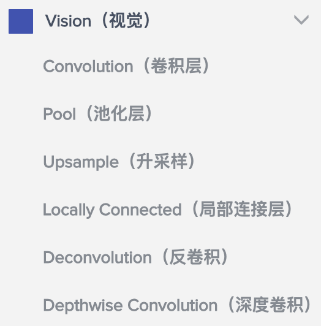

- 卷积层（Convolution）（Keras，Tensorflow）

  ​	卷积神经网络(CNN)第一次提出是在1997年，杨乐春（LeNet）的一篇关于数字OCR识别的论文，在2012年的ImageNet竞赛中CNN网络成功击败其它非DNN模型算法，从此获得学术界的关注与工业界的兴趣。卷积神经网络中每层卷积层（Convolutional layer）由若干卷积单元组成，每个卷积单元的参数都是通过反向传播算法最佳化得到的。卷积运算的目的是提取输入的不同特征，第一层卷积层可能只能提取一些低级的特征如边缘、线条和角等层级，更多层的网路能从低级特征中迭代提取更复杂的特征。在VisualNN系统中可以通过卷积层来设置1D，2D，3D等参数来设置不同类型的卷积层。

- 池化层（Pool）（Keras，Tensorflow）

  ​	在CNN网络中卷积池之后会跟上一个池化层也叫下采样层，池化层的作用是提取局部均值与最大值，根据计算出来的值不一样就分为均值池化层与最大值池化层，一般常见的多为最大值池化层。池化层可以非常有效地缩小参数矩阵的尺寸，从而减少最后全连层中的参数数量。使用池化层即可以加快计算速度也有防止过拟合的作用。池化的时候同样需要提供filter的大小、步长等参数。池化还能降低输出结果的维度，（理想情况下）却能保留显著的特征。

- 升采样（Upsample）（Keras）

  ​	升采样，也即插值。对于图像来说即是二维插值，图像放大几乎都是采用内插值方法，即在原有图像像素的基础上在像素点之间采用合适的插值算法插入新的元素。如果升采样系数为$k$，即在原图$n$与$n+1$两点之间插入$k-1$个点，使其构成$k$分。二维插值即在每行插完之后对于每列也进行插值。 插值的方法分为很多种，一般主要从时域和频域两个角度考虑。对于时域插值，最为简单的是线性插值。除此之外，Hermite插值，样条插值等等均可以从有关数值分析书中找到公式，直接代入运算即可。对于频域，根据傅里叶变换性质可知，在频域补零等价于时域插值。所以，可以通过在频域补零的多少实现插值运算。在VisualNN系统中可以通过升采样层来设置1D，2D，3D等参数来设置不同类型的升采样层。

- 局部连接层（Locally Connected）（Keras）

  ​	局部连接网络。每个隐含单元仅仅连接输入图像的一小片相邻区域，那么这就是一种局部连接方式。网络部分连通的思想，是受启发于生物学里面的视觉系统结构，视觉皮层的神经元就是局部接受信息的（即这些神经元只响应某些特定区域的刺激）。利用这样一种局部连接结构，一方面降低了需要学习的参数数量，提高了前向传播和反向传播的计算速度；另一方面，这种结构所具有的局部感受能力也更符合人类视觉系统的认知方式。同时，卷积神经网络真正实现了端到端的学习，一个网络结构包括了特征提取和分类两部分，更适合实际业务中的算法部署。在VisualNN系统中可以通过升采样层来设置1D、2D等参数来设置不同类型的局部连接层。

- 反卷积层（Deconvolution）（Keras，Tensorflow）

  ​	反卷积（Deconvolution）的概念第一次出现是Zeiler在2010年发表的论文Deconvolutional networks中，但是并没有指定反卷积这个名字，反卷积这个术语正式的使用是在其之后的工作中。随着反卷积在神经网络可视化上的成功应用，其被越来越多的工作所采纳比如：场景分割、生成模型等。其中反卷积（Deconvolution）也有很多其他的叫法，比如：Transposed Convolution，Fractional Strided Convolution等等。卷积计算对应的反卷积操作的输入输出关系正好相反，卷积层输入多个，输出单一的激活值，反卷积输入一个,输出多个激活值。如果不考虑通道以卷积运算的反向运算来计算反卷积运算的话，我们还可以通过离散卷积的方法来求反卷积。 

- 深度卷积层（Depthwise Convolution）（Keras，Tensorflow）

  ​	深度卷积是对输入的每一个channel独立的用对应channel的所有卷积核去卷积，假设卷积核的shape是[filter_height, filter_width, in_channels, channel_multiplier]，那么每个in_channel会输出channel_multiplier那么多个通道，最后的feature map就会有in_channels * channel_multiplier个通道了。反观普通的卷积，输出的feature map一般就只有channel_multiplier个通道。在Keras与TensorFlow中都提供了深度卷积层的实现。

### 3.3 循环层（Recurrent）

​	循环层（Recurrent Layer）在Keras中是循环层的抽象类，一般不在在模型中直接应用该层（因为它是抽象类，无法实例化任何对象）。一般使用它的子类LSTM，GRU或SimpleRNN来实现，因此VsualNN也提供了三种不同类型的循环神经网络的标签以供使用。分别是RNN（循环神经网络）、GRU（门控循环单元）、LSTM（长短期记忆网络）。

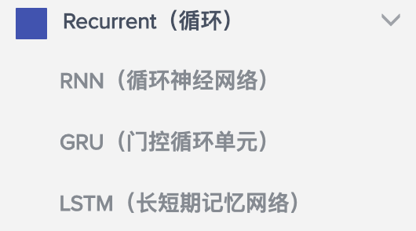

+ 循环神经网络（RNN）（Keras）

  ​	循环神经网络（Recurrent Neural Network，RNN）是一类专门用于处理时序数据样本的神经网络，它的每一层不仅输出给下一层，同时还输出一个隐状态，给当前层在处理下一个样本时使用。就像卷积神经网络可以很容易地扩展到具有很大宽度和高度的图像，而且一些卷积神经网络还可以处理不同尺寸的图像，循环神经网络可以扩展到更长的序列数据，而且大多数的循环神经网络可以处理序列长度不同的数据。它可以看作是带自循环反馈的全连接神经网络。循环神经网络的一个重要特性是：在不同时刻，模型的参数是共享的，这使得我们可以在时间上共享不同位置的统计强度。

+ 长短期记忆网络（LSTM）（Keras）

  ​	时序反向传播算法按照时间的逆序将错误信息一步步地往前传递。当每个时序训练数据的长度较大或者时刻较小时，损失函数关于时刻隐藏层变量的梯度比较容易出现消失或爆炸的问题（也称长期依赖问题）。梯度爆炸的问题一般可以通过梯度裁剪来解决，而梯度消失问题则要复杂的多，人们进行了很多尝试，其中一个比较有效的版本是长短期记忆神经网络（Long Short-Term Memory，LSTM）。LSTM 的主要思想是：门控单元以及线性连接的引入 。LSTM区别于RNN的地方，主要就在于它在算法中加入了一个判断信息有用与否的“处理器”，这个处理器作用的结构被称为cell。一个cell当中被放置了三扇门，分别叫做输入门、遗忘门和输出门。一个信息进入LSTM的网络当中，可以根据规则来判断是否有用。只有符合算法认证的信息才会留下，不符的信息则通过遗忘门被遗忘。LSTM可以在反复运算下解决神经网络中长期存在的大问题。目前已经证明，LSTM是解决长序依赖问题的有效技术，并且这种技术的普适性非常高，导致带来的可能性变化非常多。

+ 门控循环单元（GRU）（Keras）

  ​	GRU即Gated Recurrent Unit。前面说到为了克服RNN无法很好处理远距离依赖而提出了LSTM，而GRU则是LSTM的一个变体，当然LSTM还有有很多其他的变体。GRU保持了LSTM的效果同时又使结构更加简单，所以它也非常流行。而GRU模型只有两个门，分别为更新门和重置门。更新门用于控制前一时刻的状态信息被带入到当前状态中的程度，更新门的值越大说明前一时刻的状态信息带入越多。重置门用于控制忽略前一时刻的状态信息的程度，重置门的值越小说明忽略得越多。

### 3.4 常用单元（Utility）

​	常用单元（Utility）实用单元中集成了对于神经网络中网络层的一些实用的工具，用于规整，连接，切分向量等操作。在VisualNN系统中提供了九个工具操作，它们分别是扁平化（Flatten）、变形（Reshape）、连结（Concat）、Eltwisw、Softmax、Permute、重复向量（Repeat Vector）、正则化（Regularization）、遮蔽（Masking）。

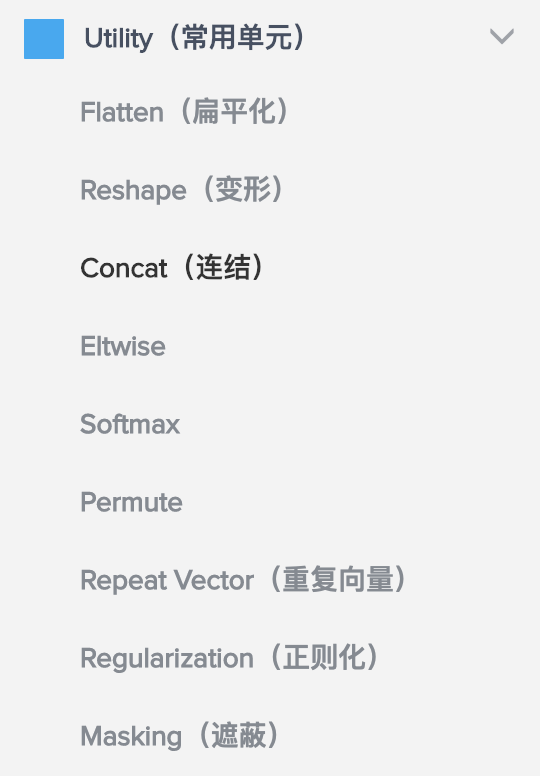

+  扁平化（Flatten）（Keras，Tensorflow）

  ​	Flatten层用来将输入“压平”，即把多维的输入一维化，常用在从卷积层到全连接层的过渡。Flatten不影响batch的大小。

+ 变形（Reshape）（Keras）

  ​	Reshape层用来将输入shape转换为特定的shape

+ 连结（Concat）（Keras，Tensorflow）

  ​	其作用是将向量按照指定的维度进行连接。

+ Eltwise（Keras，Tensorflow）

  ​	针对于两个向量，Eltwise层的操作有三个：product（对应相乘）， sum（相加减），max（取大值），Average（取平均），Dot（点乘），其中sum是默认操作。

+ Softmax（Keras，Tensorflow）

  ​	Softmax 函数可以把它的输入，通常被称为 logits 或者 logit scores，处理成 0 到 1 之间，并且能够把输出归一化到和为 1。

+  Permute（Keras）

  ​	Permute层将输入的维度按照给定模式进行重排，例如，当需要将RNN和CNN网络连接时，可能会用到该层。

+ 重复向量（Repeat Vector）（Keras）

  ​	Repeat Vector标签用于将输入输入向量重复n次。

+ 正则化（Regularization）（Keras）

  ​	数据量比较小会导致模型过拟合, 使得训练误差很小而测试误差特别大. 通过在Loss Function 后面加上正则项可以抑制过拟合的产生. 缺点是引入了一个需要手动调整的hyper-parameter。经过本层的数据不会有任何变化，但会基于其激活值更新损失函数值。VisualNN提供L1与L2两个正则化项。

+  遮蔽（Masking）（Keras）

  ​	使用给定的值对输入的序列信号进行“屏蔽”，用以定位需要跳过的时间步。对于输入张量的时间步，即输入张量的第1维度（维度从0开始算），如果输入张量在该时间步上都等于mask value，则该时间步将在模型接下来的所有层（只要支持masking）被跳过（屏蔽）。

### 3.5 激活层（Activation/Neuron）

​	激活层（Activation/Neuron）激活函数也是神经网络中一个很重的部分。每一层的网络输出都要经过激活函数。VisualNN提供了比较常用了几个激活函数：ReLU/Leaky-ReLU、PReLU、ELU、Threshold ReLU、SELU、Softplus、Softsign、Sigmod、TanH、Hard Sigmod。

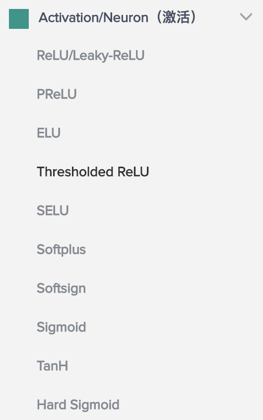

+  ReLU/Leaky-ReLU（Keras，Tensorflow）

  ​	ReLU是将所有的负值都设为零，相反，Leaky ReLU是给所有负值赋予一个非零斜率。Leaky ReLU激活函数是在声学模型（2013）中首次提出的。以数学的方式我们可以表示为：

  ​						 $y_i=\begin{cases}
  x_i (x_i\geq 0)\\
  \frac{x_i}{a_i} (x_i< 0)\\
  \end{cases}$

+  PReLU（Keras）

  ​	PReLU可以看作是Leaky ReLU的一个变体。在PReLU中，负值部分的斜率是根据数据来定的，而非预先定义的。在ImageNet分类（2015，Russakovsky等）上作者称，PReLU是超越人类分类水平的关键所在。

+  ELU（Keras，Tensorflow）

  ​	ELU函数曲线为：

  ​					$f(x)=\begin{cases}
  x (x\geq 0)\\
  \alpha(e^x-1) (x< 0)\\
  \end{cases}$

  该函数融合了sigmoid和ReLU，左侧具有软饱和性，右侧无饱和性。右侧线性部分使得ELU能够缓解梯度消失，而左侧软饱能够让ELU对输入变化或噪声更鲁棒。ELU的输出均值接近于零，所以收敛速度更快。

+ Threshold ReLU（Keras）

  该层是带有门限的ReLU，表达式是：

  ​						$f(x)=\begin{cases}
  x (x\geq \theta)\\
  0 (x<  \theta)\\
  \end{cases}$

+ SELU（Keras，Tensorflow）

  ​					$f(x)=\lambda\begin{cases}
  x (x\geq 0)\\
  \alpha(e^x-1) (x< 0)\\
  \end{cases}$

  ​	SELU为ELU乘上$\lambda$，该$\lambda$是大于1的。以前relu，prelu，elu这些激活函数，都是在负半轴坡度平缓，这样在activation的方差过大的时候可以让它减小，防止了梯度爆炸，但是正半轴坡度简单的设成了1。而selu的正半轴大于1，在方差过小的的时候可以让它增大，同时防止了梯度消失。这样激活函数就有一个不动点，网络深了以后每一层的输出都是均值为0方差为1。

+  Softplus（Keras，Tensorflow）

  ​	Softplus函数是Logistic-Sigmoid函数原函数，$f(x)=\log(e^x+1)$。由于$(1+e^x)$后期梯度过大，难以训练，于是增加log来减缓上升趋势。加1保证非负性。同年，Charles Dugas等人在NIPS会议论文中说明Softplus可以看作是强制非负校正函数$\max(0,x)$平滑版本。

+ Sigmod（Keras，Tensorflow）

  ​	Sigmoid$f(x)=\frac{1}{1+e^x}$函数是一个在生物学中常见的S型函数，也称为S型生长曲线。在信息科学中，由于其单增以及反函数单增等性质，Sigmoid函数常被用作神经网络的阈值函数，将变量映射到$(0,1)$之间。

+ TanH（Keras，Tensorflow）

  ​	TanH的函数为：$f(x)=\frac{e^x-e^{-x}}{e^x+e^{-x}}$，也称为双切正切函数，取值范围为$[-1,1]$。TanH在特征相差明显时的效果会很好，在循环过程中会不断扩大特征效果。与 sigmoid的区别是，TanH 是 0 均值的，因此实际应用中 TanH 会比 sigmoid 更好。

+ Hard Sigmod（Keras）

  ​	Hard Sigmod（$f(x)=\max(0,\min(1,\frac{x+1}{2}))$是Logidtic Sigmod激活函数的分段近似。它更容易计算，这使得学习计算的速度更快，尽管首次派生值为0可能导致静默神经元/过慢的的学习速率。

### 3.6 归一化层（Normalization）

​	归一化层（Normalization）是能够对输入输出进行归一化操作的结构层，为Keras与Tensorflow所拥有的结构层，含有两个部分，分别是局部相应归一化（LRN）和批量归一化（Batch Norm）。

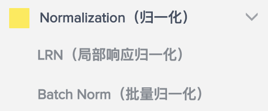

+ 局部相应归一化（LRN）（Keras，Tensorflow）

  ​					$b^i_{x,y}=\frac{a^i_{x,y}}{k+\alpha \sum_{j=\max(0,i-\frac{n}{2})}^{{\min(N-1,i+\frac{n}{2})}}(a^i_{x,y})^2}$

  ​	局部归一的动机：在神经生物学有一个概念叫做侧抑制(lateral inhibitio),指的是被激活的神经元抑制相邻神经元。归一化(normalization)的目的是“抑制”，局部响应归一化就是借鉴侧抑制的思想来实现局部抑制，尤其当我们使ReLU的时候这种“侧抑制”很管用。LRN层模仿生物神经系统的侧抑制机制，对局部神经元的活动创建竞争机制，使得响应比较大的值相对更大，提高模型范化能力。在Hintonl的Imagenet中表明分别提升1.4%和1.2%，$a$表示第$i$个核在位置$(x,y)$运用ReLU非线性化神经元输出，$n$是同一位置上临近的kernel map的数目，$N$是也是kemel的总数。

+ 批量归一化（Batch Norm）（Keras，Tensorflow）

  ​	批量归一化对输入数据做了归一化处理，就是将每个特征在所有样本上的值转归一化成均值0方差1。这样我们保证训练数据里数值都同样量级上，从而使得训练的时候数值更加稳定。对于浅层模型来说，通常数据归一化预处理足够有效。输出数值在只经过几个神经层后通常不会出现剧烈变化。但对于深层神经网络来说，情况一般比较复杂。因为每一层里都对输入乘以权重后得到输出。当很多层这样的相乘累计在一起时，一个输出数据较大的改变都可以导致输出产生巨大变化，从而带来不稳定性。批量归一化层的提出是针对这个情况。它将一个批量里的输入数据进行归一化然后输出。如果我们将批量归一化层放置在网络的各个层之间，那么就可以不断的对中间输出进行调整，从而保证整个网络的中间输出的数值稳定性。

### 3.7 常规层（Common）

​	常规层（Common）是神经网络最为常规的一部分，主要包含了三个部分，分别是全连接层（Inner Product）、舍弃（Dropout）和嵌入（Embed）。

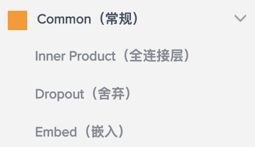

+  全连接层（Inner Product）（Keras，Tensorflow）

  ​	Inner Product即是全连接层，图像分类中，网络结构的最后一般有一个或多个全连接层。全连接层的每个节点都与其上层的所有节点相连，以综合前面网络层提取的特征。其全连接性，导致参数较多.全连接层将卷积的 2D 特征图结果转化为 1D 向量。

+  舍弃（dropout）（Keras，Tensorflow）

  ​	Dropout可以作为训练深度神经网络的一种trick供选择。在每个训练批次中，通过忽略部分的特征检测器（让部分的隐层节点值为0），可以明显地减少过拟合现象。这种方式可以减少特征检测器（隐层节点）间的相互作用，检测器相互作用是指某些检测器依赖其他检测器才能发挥作用。Dropout说的简单一点就是：我们在前向传播的时候，让某个神经元的激活值以一定的概率$p$停止工作，这样可以使模型泛化性更强，因为它不会太依赖某些局部的特征

+ 嵌入（Embed）（Keras）

  ​	Embed层只能作为模型的第一层，是针对NLP的，将原始One-Hot编码的词（长度为词库大小）映射到低维向量表达，降低特征维数。

### 3.8 噪声层（Noise）

​	噪声层（Noise）在Keras中是的抽象类，主要是在输入数据中加入噪声，减轻过拟合的现象。VisualNN中提供了三种噪声方式：加性高斯噪声（Gaussian Noise）、乘性高斯噪声（Gaussian Dropout）、Alpha Dropout。

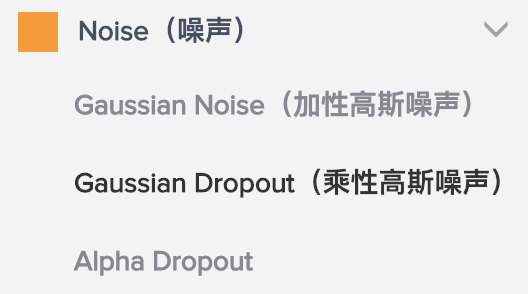

+ 加性高斯噪声（Gaussian Noise）（Keras）

  ​	为数据施加0均值，标准差为$\sigma$的加性高斯噪声。该层在克服过拟合时比较有用，你可以将它看作是随机的数据提升。高斯噪声是需要对输入数据进行破坏时的自然选择。因为这是一个起正则化作用的层，该层只在训练时才有效。

+ 乘性高斯噪声（Gaussian Dropout）（Keras）

  为层的输入施加以1为均值，标准差为$\sqrt{p/(1-p)}$的乘性高斯噪声。因为这是一个起正则化作用的层，因此该层只在训练时才有效。

+ Alpha Dropout（Keras）	

  ​	Alpha Dropout是一种保持输入均值和方差不变的Dropout，该层的作用是即使在dropout时也保持数据的自规范性。 通过随机对负的饱和值进行激活，Alphe Drpout与selu激活函数配合较好。

### 3.9 包装器层（Wrapper）

​	包装器层（Wrapper）为Keras所特有，主要包括两个包装器，分别是时间分布包装器（Time Distributed）和双向RNN包装器（Bidirectional）。

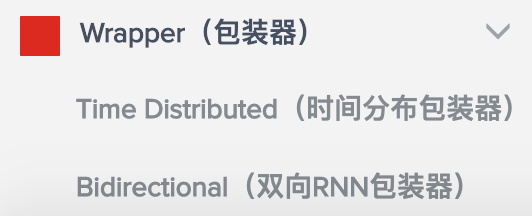

+  时间分布包装器（Time Distributed）（Keras）	

  ​	输入至少为3D张量，下标为1的维度将被认为是时间维。在搭建需要独立连接时的结构时需要用到，比如在faster rcnn中，在最后fast rcnn的结构中进行类别判断和box框的回归时，需要对num_rois个感兴趣区域ROIs进行回归处理，每一个区域的处理是相对独立的，等价于此时的时间步为num_rois。

+ 双向RNN包装器（Bidirectional）（Keras）	

  ​	Bidirectional 是RNN的双向封装器，对序列进行前向和后向计算。

 

